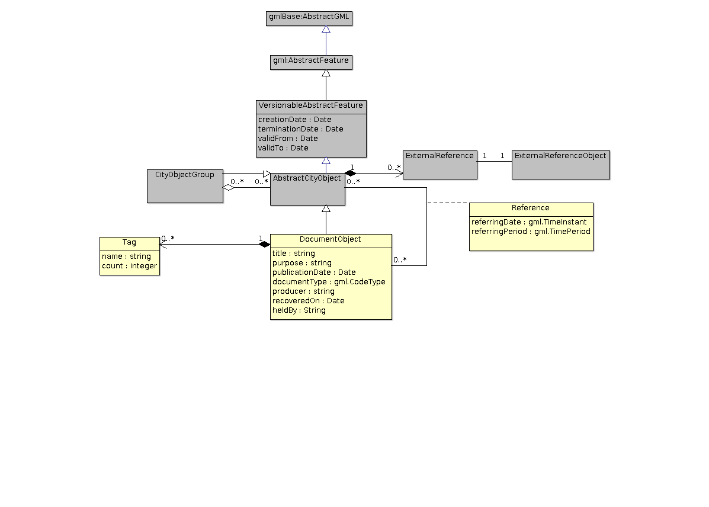
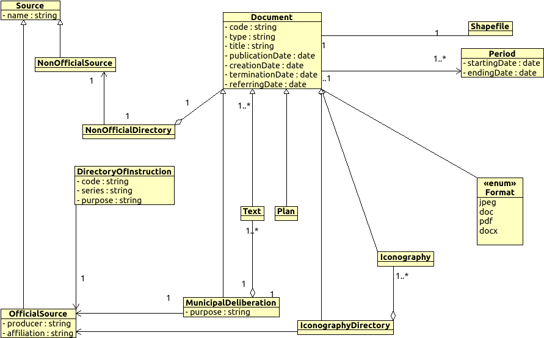

# Document ADE

# Current Proposition
#### Publication Date: March 18, 2016

## Open Problems
- What's the precise definition of a referring date?
- Shouldn't there be many referring dates for a particular city object in a document? 
- Do we require any other attributes to describe a reference? What is the purpose of the reference? Is it an imaginary project or date?

## Evolution of Document ADE
### First proposition 
#### Publication Date: March 3, 2016
After understanding the requirements specified by Clémentine Périnaud, the following UML diagram was proposed.

#### Open Problems
- Is the above diagram generic enough?
- Why just Inconography directory and not text directory or plan directory?
- How to classify source? official/non-official?

### Second Proposition 
#### Publication Date: March 15, 2016

#### Open Problems
- Why do we need to create a class called Agent or Agent Group, instead of giving a reference to the external data source which may have all the details?
- Is there really need for the AbstractLocation class?
