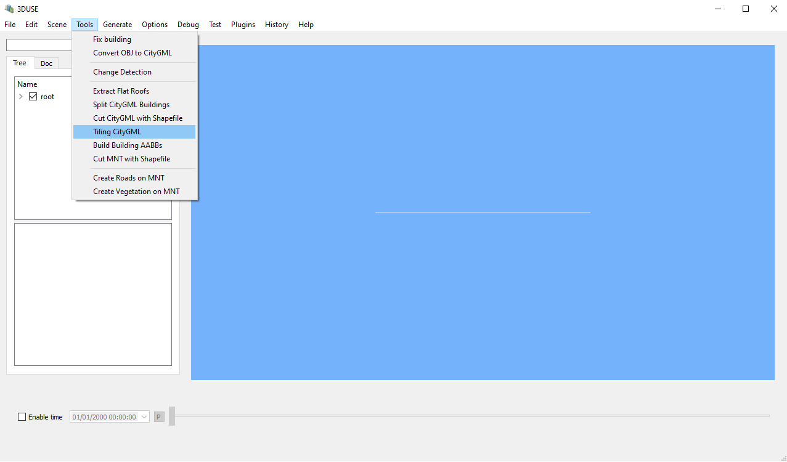
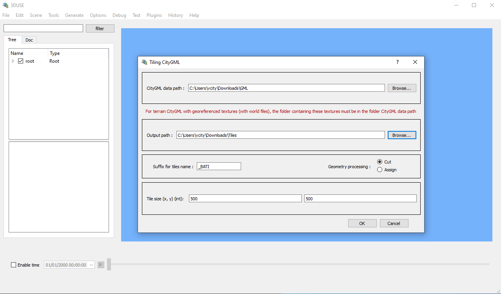

# How to create Tiles in 3DUSE

# Introduction
We will explain how to make a Tile in 3DUSE that can be used in every plugin of 3DUSE. A Tile is the product of cutting a larger gml in a regular grid.

# Prerequisites
- 3DUSE installed on your computer, here a [link](https://github.com/VCityTeam/3DUSE/blob/master/Install.md) on installing 3DUSE.
- A basic gml file.

# How to create Tiles

Step 1: Launch 3DUSE.  
Step 2: Go to Tools > Tiling CityGML.

You will see the tiling window :

Step 3: Set the folder containing all gml to Tiles in "CityGML data path" and
set the output path to get your beautiful Tiles.

# Tiling Window Parameters
- CityGML data path : The root folder containing all the gml files use for the tiling.
- Output path : Directory containing all tiles.
- Tile size : Tile size in meter.
- Geometry processing : How to dispatch each cityobjects in a tile :
  - Assign : Tiling by assigning cityobjects according to the position of their center of gravity.
  - Cut : Tiling by cutting geometries according to the tile boundaries.
