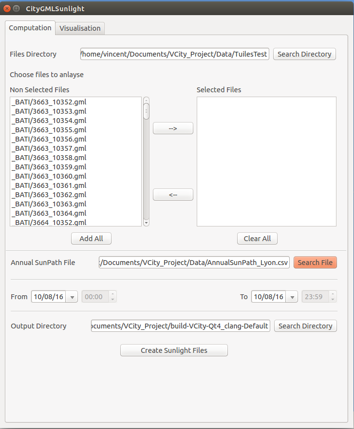
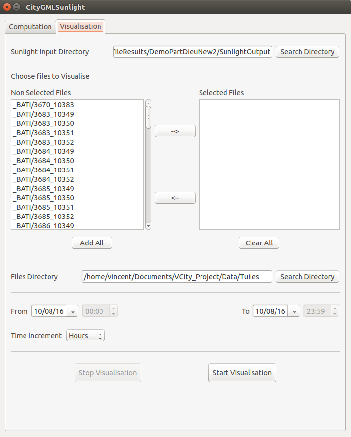
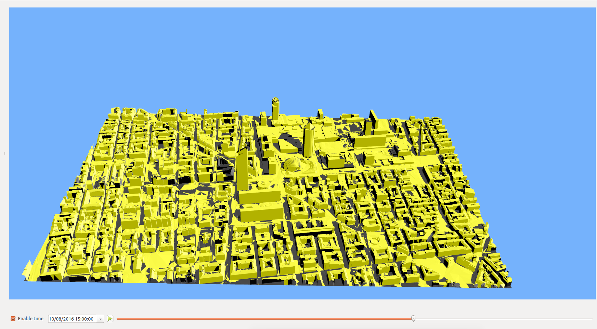

# Sunlight Plugin User Guide

## Introduction

This document presents how to use the Sunlight Plugin of 3D-USE.

## Prerequisites

In order to use the Sunlight plugin, you must have the following files :

- A set of CityGML files organized in layers (_BATI, _MNT, _WATER, _VEGET).
- Axis Aligned Bounding Boxes (AABB) of the citygml files by layers. They can be generated using the AABB computation process in Visibility Plugin. For more informations, please refer to [this](https://github.com/MEPP-team/VCity/blob/master/doc/Visibilite/Doc-PluginVisibilite.pdf) documentation.
- AABB of Buildings and Building Parts of Tiles of the _BATI layer. In order to generate these, you need to use the "Build Buildings AABB" option in 3D-USE menu.
- An input file giving the path of the sun during the period you want to run the computation of sunlight and shadow. An example file can be found in : .... This example file has been generated for the city of Lyon using this tool (which doesn't seems to work anymore) : http://www.sunearthtools.com/dp/tools/pos_sun.php?lang=fr

*Note : The parser of the above-mentionned input file is in `src/plugins/CityGMLSunlightQtPlugin/IO.cxx`, function  `std::map<int,TVec3d> loadSunpathFile(std::string sunpathFile, int iStartDate, int iEndDate)` and needs to be modified if another input file is used.*

*Note 2 : The following website provides more precise results for sun positions but only gives the result for a given hour and doesn't have a feature for the generation of an excel sheet with all the sun positions on a given period of time : https://www.esrl.noaa.gov/gmd/grad/solcalc/ . The best way would be to implement a sun position computation algorithm.*

*Note 3 : There is a timeshift in loadSunpathFile function which allows to consider time changes in march and november. Two parts of this function (delimited by comments about time changes) needs to be commented out if the sun positions are already computed considering time changes (which can be the case when using the tool from Note 2.*

## How to use the plugin

### Sunshine and Shadow Computation

- Start 3DUSE

- Go to the plugin tab and choose "CityGMLSunlightQtPlugin". The following window will pop up :

*Note: The first time you will use the plugin, all the fields will be empty.*

- The first line allows you to choose the path to the folder holding all the CityGML files. When you have chosen this folder, the list of Non Selected Files located just below on the left will be filled with all the CityGML files of this directory.

- Once the list on the left is filled, you can add the files you want to compute sunshine for into the Selected Files list on the right. In order to do that, you must select files on the left (ctrl and shift can be used for special selections) and add them using the arrows in the middle. You can also use the buttons "Add all" or "Clear all".

- Then, you must choose the path to the file holding the path of the sun for the period of sunshine computation.

- After that, you can choose the period of computation using the calendar boxes below. 

*Note : The Computation starts on the day on the left at 00:00 and ends on the day on the right at 23:59.*

- Finally, you can choose an output folder where the .csv results files will be saved. The output architecture is as follow :

- Once all the fields are filled, you can press the Create Sunlight Files button.

*Note: You can follow the progress of the computation by looking to the console output of the application.*

### Sunshine and Shadow Visualisation

- Once the computation is finished, click on the Visualisation tab of the plugin. You should see the following window:

- In the first line, you must choose the directory where the results files are located (files computed of the previous section).

- Then you can choose the files to visualize from the list of Non Selected files on the left and add them to the list of Selected Files on the right as in the computation part.

- After that, choose the directory where your CityGML files are located.

- Below, you can choose the visualisation period using the calendar boxes.

- Finally, hit the "Start Visualisation" button. It will load the specified CityGML files and the associated Sunshine results files.

- Once you've started the visualisation, move the plugin windows away. You should now see the files you selected for visualisation loaded in 3D-USE.

*Note: The first time you use the visualisation of the plugin, you must go into the settings of 3D-USE and change the animation step to 3600 seconds.*

- You can now visualize the sunshine and shadow on requested files using the temporal slidebar. You should see something like this :

