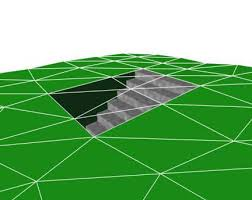
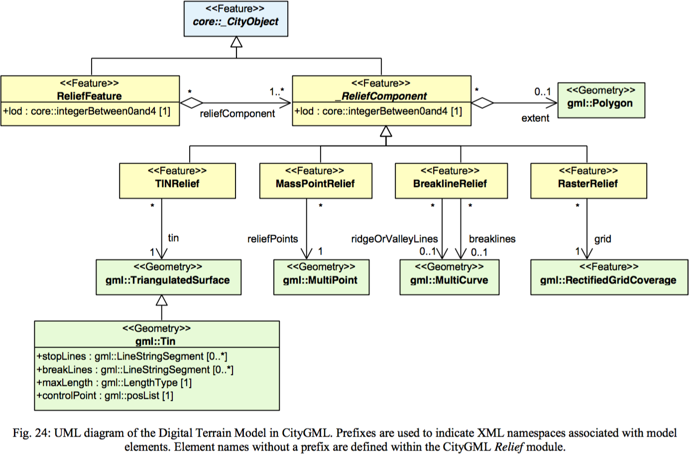
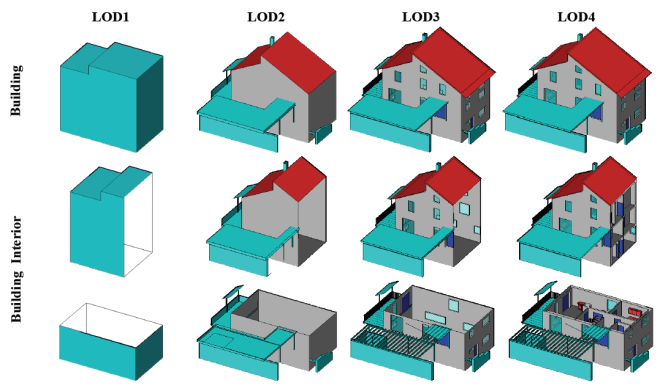
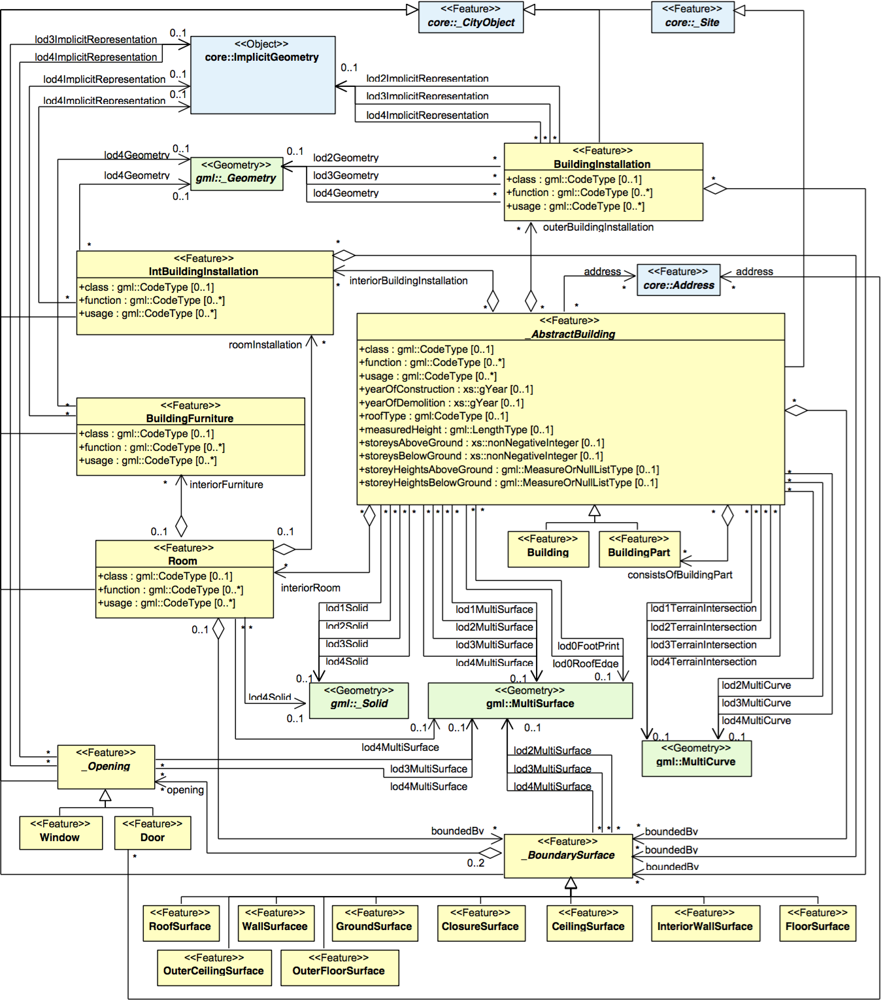
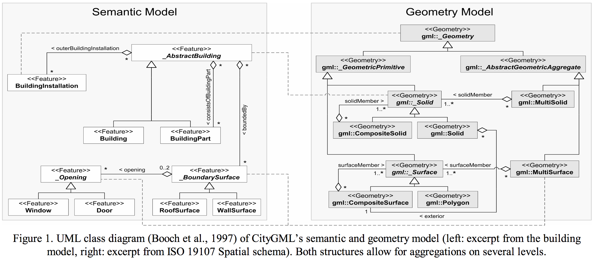
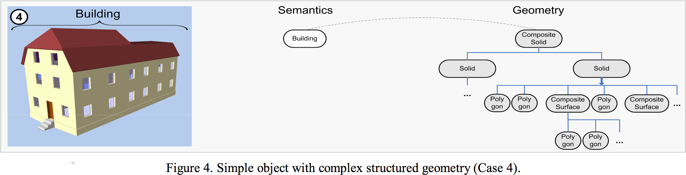
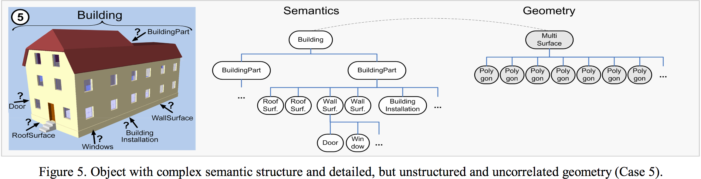
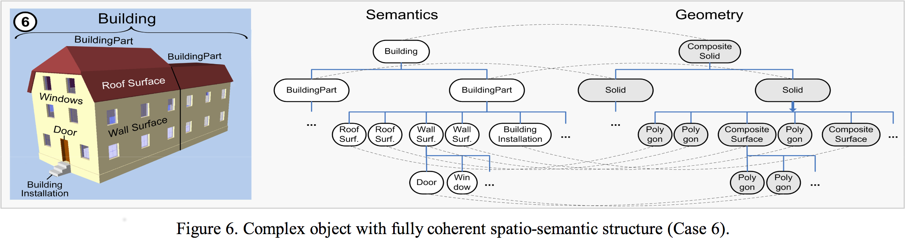

[TOC]

### Introduction
The following description is based on [CityGML version 2.0](https://portal.opengeospatial.org/files/?artifact_id=47842). CityGML is an application schema for the Geography Markup Language version 3.1.1 (aka GML3) from which is draws its geometry classes (refer to Annex D).

[CityGML V2.0 UML diagrams, page 5](http://www.citygml.org/fileadmin/citygml/docs/CityGML_2_0_0_UML_diagrams.pdf)

### Underlying geometric primitives are few (GML based)
#### Digital Terrain Model (Relief component)
 (Rectified Grid Coverage example: [source](https://portal.opengeospatial.org/files/?artifact_id=3D16675))
 (Triangulated Surface example: [source](https://3d.bk.tudelft.nl/hledoux/img/valkenburg3d.png))

As illustrated by the following figure, the **Relief component** (Digital Terrain Model) **surfacic** geometry can be:
 * `RectifiedGridCoverage` i.e. a regular grid height field
 * `TriangulatedSurface` i.e. a collection of topologically disjoint triangles.

(source: figure 24, page 57 of [CityGML version 2.0](https://portal.opengeospatial.org/files/?artifact_id=47842)).

#### Buildings
 ([source](http://www.simstadt.eu/design/images/LODs.png))


(source diagram page 11 of [CityGML V2.0 UML diagrams](http://www.citygml.org/fileadmin/citygml/docs/CityGML_2_0_0_UML_diagrams.pdf))

### GML: everything boils down to `gml:_Ring`

(source diagram page 5 of [CityGML V2.0 UML diagrams](http://www.citygml.org/fileadmin/citygml/docs/CityGML_2_0_0_UML_diagrams.pdf))

A Triangle patch xml example ([Source](https://github.com/tudelft3d/CityGML-schema-validation/blob/master/schemas/v0.4/Examples/Appearance.xml#L242)):
```
     <gml:trianglePatches>
       <gml:Triangle>
          <gml:exterior>
            <gml:LinearRing>
              <gml:posList>
                -6.0 5.0 0.0
                 0.0 5.0 0.0
                -6.0 9.0 0.0
                -6.0 5.0 0.0
              </gml:posList>
            </gml:LinearRing>
          </gml:exterior>
       </gml:Triangle>
       <gml:Triangle>
           ...
       </gml:Triangle>
     </gml:trianglePatches>
```
Refer to gml's definitions: [TriangulatedSurface](http://www.datypic.com/sc/niem21/e-gml32_TriangulatedSurface.html),
[Patches](http://www.datypic.com/sc/niem21/e-gml32_patches.html) and [Triangle](http://www.datypic.com/sc/niem21/e-gml32_Triangle.html).

### No hope for "fixing the topology"
As specified in GML 3.1.1 spec, page 23: "A GML object is an XML element of a type derived (...) from AbstractGMLType. From this derivation, a GML object may have a gml:id attribute."
We could hope to provide each `gml:pos` (spatial position) with an id, and define a triangle as three ids of positions. Alas the norm imposes to repeat position coordinates and thus **CityGML does not allow to topologically relate vertices of two triangles**. This has to be indirectly done through coordinates comparison...

### Semantic vs Geometry hierarchies (possibly coherent)
Semantic and geometry hierachies can (and thus will) lack coherence:





### Conclusion
```
    CityGMLFeature (Buildings, Terrain)
     --> boundary surface
        --> gml:multisurface
           --> gml:_Surface
              --> gml:Triangle
			     --> gml:_Ring
				    --> list of 3 points coordinates
```
**CityGML surfacic geometries are [polygon soups](https://en.wikipedia.org/wiki/Polygon_soup) i.e. groups of unorganized triangles, with generally no relationship whatsoever. Geometrical "proximity" (based on coordinates comparison) blended with hierarchic semantic information can be used to reconsitute 2-manifold (flat) polygons / triangle based surfaces.**

### References
 * [CityGML version 2.0](https://portal.opengeospatial.org/files/?artifact_id=47842)
 * [CityGML V2.0 UML diagrams](http://www.citygml.org/fileadmin/citygml/docs/CityGML_2_0_0_UML_diagrams.pdf)
 * [Stadler, A., Kolbe, T. H. (2007): Spatio-Semantic Coherence in the Integration of 3D City Models](http://www.isprs.org/proceedings/XXXVI/2-C43/Session1/paper_Stadler.pdf)